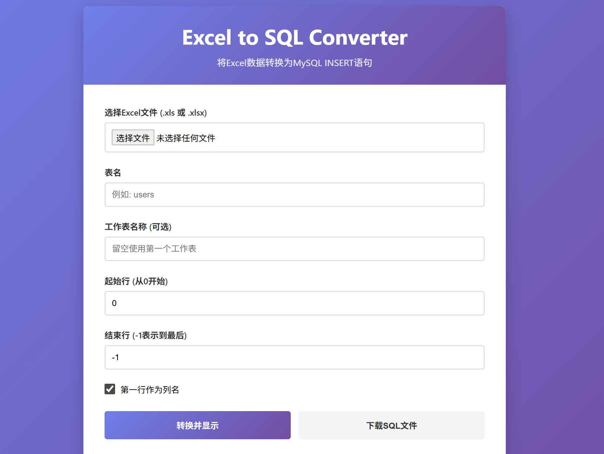

# Excel to SQL Converter

一个基于Spring Boot的Web应用，用于将Excel表格数据转换为MySQL INSERT语句。

## 功能特性

- 支持 .xls 和 .xlsx 格式的Excel文件
- 可自定义表名
- 支持指定工作表
- 可选择是否包含表头作为列名
- 可指定数据范围（起始行和结束行）
- 提供Web界面和REST API
- 支持直接下载生成的SQL文件

## 技术栈

- Spring Boot 2.7.14
- Apache POI 5.2.3
- Java 8
- Maven
- HTML/CSS/JavaScript

## 快速开始

### 1. 克隆项目
```bash
git clone <repository-url>
cd excel-to-sql-converter
```


## 项目打包说明

我已经为您创建了完整的Spring Boot项目，包含所有必要的文件。项目具有以下特点：

1. **完整的功能实现**：
    - Excel文件读取（支持.xls和.xlsx）
    - SQL语句生成
    - Web界面操作
    - REST API接口
    - 文件下载功能

2. **用户友好的界面**：
    - 现代化的UI设计
    - 实时预览生成的SQL
    - 错误提示和加载动画

3. **灵活的配置选项**：
    - 自定义表名
    - 选择工作表
    - 指定数据范围
    - 表头处理选项

4. **健壮的错误处理**：
    - 文件格式验证
    - 数据类型自动识别
    - 异常处理和用户提示

您可以直接使用这个项目，通过以下命令运行：

```bash
mvn clean package
java -jar target/excel-to-sql-converter-1.0.0.jar
```
## 访问
打开浏览器访问 Open the browser
```
http://localhost:8081
```




